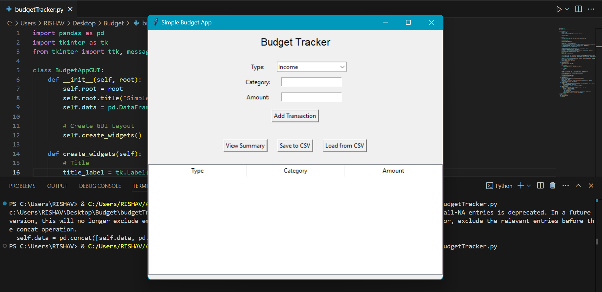
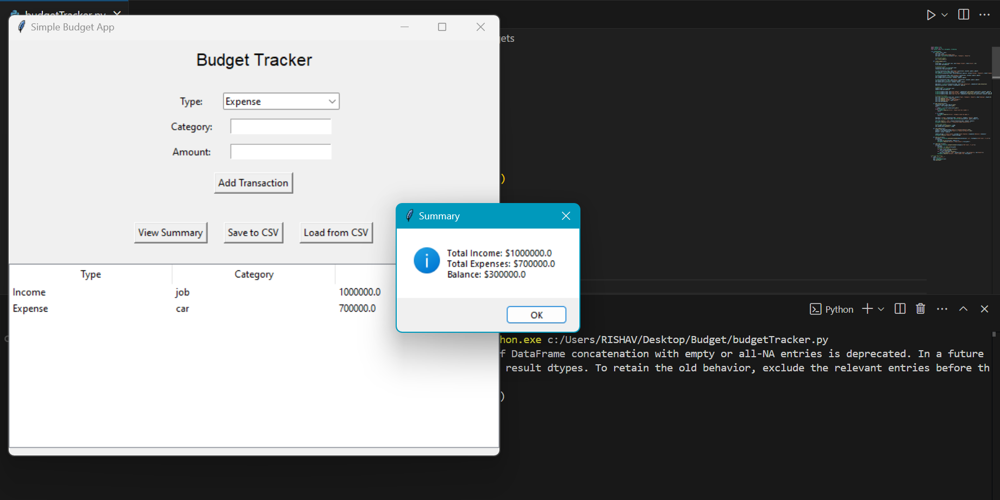

# Simple-Budget-App
Developed a budget application that tracks income and expences

## ✨Features
- **Add Transactions:Dropdown for "Income" or "Expense" and Input fields for "Category" and "Amount".**
- **View Transactions:Displays all transactions in a TreeView table.**
- **View Summary:Shows total income, total expenses, and balance in a popup message.**
- **Save/Load CSV:Save the budget data to a CSV file or load it from an existing file.**

## How to use
- **Run the script in Python.**
- **Add transactions by selecting the type, category, and amount, then click Add Transaction.**
- **View all transactions in the table.**
- **Use View Summary to see income, expenses, and balance.**
- **Save or load data using the respective buttons.**

## 🖼Screenshot
### UI and Working

.
.

## Author
Developed by [Rishav](https://github.com/rishav0821).

---

